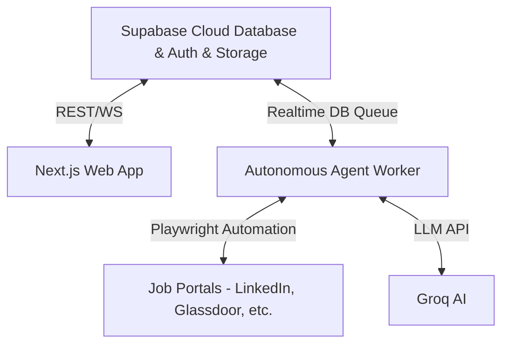

# JobNavi - Production Deployment Guide & Industry Standards Verification

This document provides a comprehensive verification report of the JobNavi codebase against modern industry standards, followed by step-by-step deployment instructions for staging and production environments.

---

## 1. Audit & Standards Compliance Summary

| Category | Standard | Status | Verification Details |
| :--- | :--- | :---: | :--- |
| **Type Safety** | TypeScript Strict Checking | ✅ PASSED | Compiled with zero errors (`npx tsc --noEmit`). |
| **Build Optimization** | Next.js Production Build | ✅ PASSED | All 22 static and dynamic routes compiled successfully (`npm run build`). |
| **Code Quality & Linting**| ESLint & React Hooks | ✅ PASSED | Fixed unescaped HTML entities and missing React hook dependencies (`npm run lint`). |
| **Database Security** | Supabase Row Level Security (RLS) | ✅ PASSED | RLS enabled on all 11 SQL tables (`jobs`, `profiles`, `files`, `applications`, `portal_accounts`, `portal_sessions`, `screenshots`, `discovery_tasks`, `pending_approvals`, `activity_logs`, `message_history`). |
| **Auth Guarding** | Session Verification | ✅ PASSED | Middleware & Route handlers check `supabase.auth.getUser()` before dataset operations. |
| **Resilience & Rate-Limiting** | Groq AI Client Rotation | ✅ PASSED | `GroqRotatingClient` supports key cycling to prevent LLM rate limit crashes. |

---

## 2. Deployment Architecture Options

JobNavi consists of two core runtime components:
1. **Next.js Web Application & API Server** (Frontend Dashboard & REST APIs)
2. **Autonomous Agent Worker Daemon** (`scripts/worker.ts` - requires Playwright Headless Chromium to execute job applications).

### Deployment Strategy Matrix



---

## 3. Step-by-Step Deployment Instructions

### Prerequisites
- Node.js **v18+** or **v20 LTS**
- A **Supabase** account ([supabase.com](https://supabase.com))
- A **Groq** API Key ([groq.com](https://groq.com))

---

### Step 1: Database & Storage Setup (Supabase)

1. Log in to your [Supabase Dashboard](https://supabase.com/dashboard) and create a new project.
2. Go to the **SQL Editor** in Supabase and paste the contents of [`supabase_schema.sql`](file:///home/dev-abuhurera/Projects/job_search_agent/supabase_schema.sql).
3. Click **Run** to execute the table creations, indexes, updated_at triggers, and RLS security policies.
4. Go to **Storage** in Supabase:
   - Create a new bucket named `resumes`.
   - Set the bucket to **Private** (or authenticated access only).
5. Retrieve your project credentials under **Project Settings -> API**:
   - `NEXT_PUBLIC_SUPABASE_URL`
   - `NEXT_PUBLIC_SUPABASE_ANON_KEY`
   - `SUPABASE_SERVICE_ROLE_KEY`

---

### Step 2: Environment Variables Configuration

Create a production `.env.local` file (or set environment variables in your deployment dashboard):

```env
# Supabase Configuration
NEXT_PUBLIC_SUPABASE_URL=https://your-project.supabase.co
NEXT_PUBLIC_SUPABASE_ANON_KEY=your_anon_key_here
SUPABASE_SERVICE_ROLE_KEY=your_service_role_key_here

# AI Engine
GROQ_API_KEY=gsk_key1,gsk_key2

# Automation & Headless Chrome Settings
HEADLESS=true
PORT=3000
NODE_ENV=production
```

---

### Option A: Docker & Docker-Compose Deployment (Recommended)

Docker handles all Linux Playwright Chromium system dependencies out of the box.

1. **Clone project onto your VPS (Ubuntu/Debian):**
   ```bash
   git clone <your-repo-url>
   cd job_search_agent
   ```

2. **Create `.env.local` with your production environment variables.**

3. **Start the Web App and Worker background service:**
   ```bash
   docker compose up -d --build
   ```

4. **Verify container status:**
   ```bash
   docker compose ps
   docker compose logs -f worker
   ```

---

### Option B: PM2 Deployment on a VPS (Ubuntu 22.04 / 24.04)

1. **Install Node.js 20 and PM2:**
   ```bash
   curl -fsSL https://deb.nodesource.com/setup_20.x | sudo -E bash -
   sudo apt-get install -y nodejs
   sudo npm install -g pm2 tsx
   ```

2. **Install Playwright Chromium dependencies:**
   ```bash
   npx playwright install-deps chromium
   npx playwright install chromium
   ```

3. **Install project dependencies & build Next.js:**
   ```bash
   npm ci
   npm run build
   ```

4. **Start Web & Worker using PM2:**
   ```bash
   pm2 start ecosystem.config.js
   pm2 save
   pm2 startup
   ```

5. **Monitor services:**
   ```bash
   pm2 status
   pm2 logs jobnavi-worker
   ```

---

### Option C: Hybrid Cloud Deployment (Vercel + VPS Worker)

1. **Deploy Web Dashboard to Vercel:**
   - Import the repository on [Vercel](https://vercel.com).
   - Set environment variables (`NEXT_PUBLIC_SUPABASE_URL`, `NEXT_PUBLIC_SUPABASE_ANON_KEY`, `SUPABASE_SERVICE_ROLE_KEY`, `GROQ_API_KEY`).
   - Deploy.

2. **Deploy Background Worker to a Linux VPS (or Railway / Render Background Worker):**
   - Clone repo on worker instance.
   - Install Playwright dependencies: `npx playwright install-deps chromium`.
   - Run worker daemon using PM2: `pm2 start "npx tsx scripts/worker.ts" --name "jobnavi-worker"`.

---

## 4. Post-Deployment Verification Checklist

- [ ] Sign up a new user via `/signup` and verify email confirmation / auth session.
- [ ] Upload a resume PDF on the `/dashboard/resume` page and confirm text extraction + AI semantic compression.
- [ ] Create a new job discovery task on `/dashboard/discovery` and verify candidate jobs appear under `/dashboard/approvals`.
- [ ] Check `/dashboard/logs` to confirm real-time worker logs are updating via Supabase Realtime channels.
